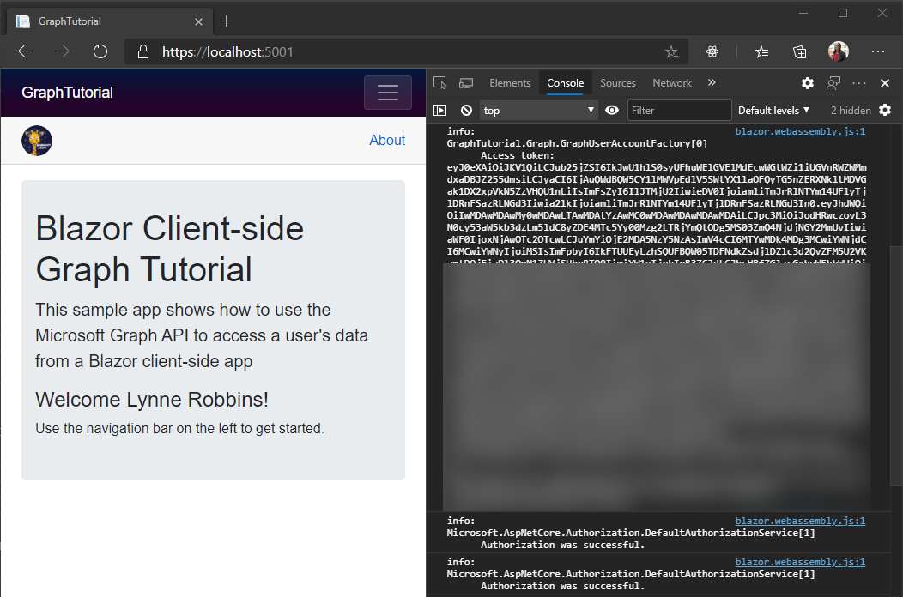

<!-- markdownlint-disable MD002 MD041 -->

En este ejercicio, ampliará la aplicación del ejercicio anterior para admitir la autenticación con Azure AD. Esto es necesario para obtener el token de acceso de OAuth necesario para llamar a la API de Microsoft Graph.

1. Open **./wwwroot/appsettings.js**. Agregue una `GraphScopes` propiedad y actualice los `Authority` `ClientId` valores y para que se correspondan con lo siguiente.

    :::code language="json" source="../demo/GraphTutorial/wwwroot/appsettings.example.json" highlight="3-4,7":::

    Reemplace `YOUR_APP_ID_HERE` por el identificador de la aplicación del registro de la aplicación.

    > [!IMPORTANT]
    > Si usa un control de código fuente como GIT, ahora sería un buen momento para excluir la **appsettings.jsen** el archivo del control de código fuente para evitar la pérdida inadvertida del identificador de la aplicación.

    Revise los ámbitos incluidos en el `GraphScopes` valor.

    - **User. Read** permite a la aplicación obtener el perfil y la foto del usuario.
    - **MailboxSettings. Read** permite a la aplicación obtener la configuración del buzón de correo, que incluye la zona horaria preferida del usuario.
    - **Calendars. ReadWrite** permite que la aplicación Lea y escriba en el calendario del usuario.

## <a name="implement-sign-in"></a>Implementar el inicio de sesión

En este momento, la plantilla de proyecto .NET Core ha agregado el código para habilitar el inicio de sesión. Sin embargo, en esta sección, agregará código adicional para mejorar la experiencia agregando información de Microsoft Graph a la identidad del usuario.

1. Abra **./pages/Authentication.Razor** y reemplace su contenido por lo siguiente.

    :::code language="razor" source="../demo/GraphTutorial/Pages/Authentication.razor" id="AuthenticationSnippet":::

    Esto reemplaza el mensaje de error predeterminado cuando se produce un error en el inicio de sesión para mostrar cualquier mensaje de error devuelto por el proceso de autenticación.

1. Cree un nuevo directorio en la raíz del proyecto denominado **Graph**.

1. Cree un archivo nuevo en el directorio **./Graph** denominado **GraphUserAccountFactory.CS** y agregue el siguiente código.

    ```csharp
    using System.Security.Claims;
    using System.Threading.Tasks;
    using Microsoft.AspNetCore.Components.WebAssembly.Authentication;
    using Microsoft.AspNetCore.Components.WebAssembly.Authentication.Internal;
    using Microsoft.Extensions.Logging;
    using Microsoft.Graph;

    namespace GraphTutorial.Graph
    {
        // Extends the AccountClaimsPrincipalFactory that builds
        // a user identity from the identity token.
        // This class adds additional claims to the user's ClaimPrincipal
        // that hold values from Microsoft Graph
        public class GraphUserAccountFactory
            : AccountClaimsPrincipalFactory<RemoteUserAccount>
        {
            private readonly IAccessTokenProviderAccessor accessor;
            private readonly ILogger<GraphUserAccountFactory> logger;

            public GraphUserAccountFactory(IAccessTokenProviderAccessor accessor,
                ILogger<GraphUserAccountFactory> logger)
            : base(accessor)
            {
                this.accessor = accessor;
                this.logger = logger;
            }

            public async override ValueTask<ClaimsPrincipal> CreateUserAsync(
                RemoteUserAccount account,
                RemoteAuthenticationUserOptions options)
            {
                // Create the base user
                var initialUser = await base.CreateUserAsync(account, options);

                // If authenticated, we can call Microsoft Graph
                if (initialUser.Identity.IsAuthenticated)
                {
                    try
                    {
                        // Add additional info from Graph to the identity
                        await AddGraphInfoToClaims(accessor, initialUser);
                    }
                    catch (AccessTokenNotAvailableException exception)
                    {
                        logger.LogError($"Graph API access token failure: {exception.Message}");
                    }
                    catch (ServiceException exception)
                    {
                        logger.LogError($"Graph API error: {exception.Message}");
                        logger.LogError($"Response body: {exception.RawResponseBody}");
                    }
                }

                return initialUser;
            }

            private async Task AddGraphInfoToClaims(
                IAccessTokenProviderAccessor accessor,
                ClaimsPrincipal claimsPrincipal)
            {
                // TEMPORARY: Get the token and log it
                var result = await accessor.TokenProvider.RequestAccessToken();

                if (result.TryGetToken(out var token))
                {
                    logger.LogInformation($"Access token: {token.Value}");
                }
            }
        }
    }
    ```

    Esta clase amplía la clase **AccountClaimsPrincipalFactory** y reemplaza el `CreateUserAsync` método. Por ahora, este método solo registra el token de acceso para fines de depuración. Implementará las llamadas de Microsoft Graph más adelante en este ejercicio.

1. Abra **./Program.CS** y agregue las siguientes `using` instrucciones en la parte superior del archivo.

    ```csharp
    using Microsoft.AspNetCore.Components.WebAssembly.Authentication;
    using GraphTutorial.Graph;
    ```

1. Dentro `Main` de, reemplace la `builder.Services.AddMsalAuthentication` llamada existente por lo siguiente.

    :::code language="csharp" source="../demo/GraphTutorial/Program.cs" id="AddMsalAuthSnippet":::

    Considere lo que hace este código.

    - Carga el valor de `GraphScopes` desde **appsettings.js** y agrega cada ámbito a los ámbitos predeterminados que usa el proveedor de MSAL.
    - Reemplaza a la fábrica de cuentas existente con la clase **GraphUserAccountFactory** .

1. Guarde los cambios y reinicie la aplicación. Use el vínculo **iniciar sesión** para iniciar sesión. Revise y acepte los permisos solicitados.

1. La aplicación se actualiza con un mensaje de bienvenida. Obtenga acceso a las herramientas de desarrollo del explorador y revise la pestaña de la **consola** . La aplicación registra el token de acceso.

    

## <a name="get-user-details"></a>Obtener detalles del usuario

Una vez que el usuario haya iniciado sesión, podrá obtener su información de Microsoft Graph. En esta sección, usará información de Microsoft Graph para agregar notificaciones adicionales al **ClaimsPrincipal** del usuario.

1. Cree un archivo nuevo en el directorio **./Graph** denominado **GraphClaimsPrincipalExtensions.CS** y agregue el siguiente código.

    :::code language="csharp" source="../demo/GraphTutorial/Graph/GraphClaimsPrincipalExtensions.cs" id="GraphClaimsExtensionsSnippet":::

    Este código implementa métodos de extensión para la clase **ClaimsPrincipal** que permiten obtener y establecer notificaciones con valores de objetos de Microsoft Graph.

1. Cree un archivo nuevo en el directorio **./Graph** denominado **BlazorAuthProvider.CS** y agregue el siguiente código.

    :::code language="csharp" source="../demo/GraphTutorial/Graph/BlazorAuthProvider.cs" id="BlazorAuthProviderSnippet":::

    Este código implementa un proveedor de autenticación para el SDK de Microsoft Graph que usa el **IAccessTokenProviderAccessor** proporcionado por el paquete **Microsoft. AspNetCore. Components. webassembly. Authentication** para obtener los tokens de acceso.

1. Cree un archivo nuevo en el directorio **./Graph** denominado **GraphClientFactory.CS** y agregue el siguiente código.

    :::code language="csharp" source="../demo/GraphTutorial/Graph/GraphClientFactory.cs" id="GraphClientFactorySnippet":::

    Esta clase crea un **GraphServiceClient** configurado con **BlazorAuthProvider**.

1. Abra **./Program.CS** y cambie la **BaseAddress** del nuevo **HttpClient** a `"https://graph.microsoft.com"` .

    :::code language="csharp" source="../demo/GraphTutorial/Program.cs" id="HttpClientSnippet":::

1. Agregue el siguiente código antes de la `await builder.Build().RunAsync();` línea.

    :::code language="csharp" source="../demo/GraphTutorial/Program.cs" id="AddGraphClientFactorySnippet":::

    Esto agrega la **GraphClientFactory** como servicio con ámbito que podemos hacer disponible a través de la inserción de dependencias.

1. Abra **./Graph/GraphUserAccountFactory.CS** y agregue la siguiente propiedad a la clase.

    ```csharp
    private readonly GraphClientFactory clientFactory;
    ```

1. Actualice el constructor para que tome un parámetro **GraphClientFactory** y asígnelo a la `clientFactory` propiedad.

    :::code language="csharp" source="../demo/GraphTutorial/Graph/GraphUserAccountFactory.cs" id="ConstructorSnippet" highlight="2,7":::

1. Reemplace la función `AddGraphInfoToClaims` existente por lo siguiente.

    :::code language="csharp" source="../demo/GraphTutorial/Graph/GraphUserAccountFactory.cs" id="AddGraphInfoToClaimsSnippet":::

    Considere lo que hace este código.

    - [Obtiene el perfil del usuario](https://docs.microsoft.com/graph/api/user-get).
        - Se usa `Select` para limitar las propiedades que se devuelven.
    - [Obtiene la foto del usuario](https://docs.microsoft.com/graph/api/profilephoto-get).
        - Solicita específicamente la versión en píxeles 48x48 de la foto del usuario.
    - Agrega la información a **ClaimsPrincipal**.

1. Abra **./Shared/LoginDisplay.Razor** y realice los siguientes cambios.

    - Reemplazar `/img/no-profile-photo.png` por `@(context.User.GetUserGraphPhoto() ?? "/img/no-profile-photo.png")` .
    - Reemplazar `placeholder@contoso.com` por `@context.User.GetUserGraphEmail()` .

    ```razor
    ...
    

    ...

    <p class="dropdown-item-text text-muted mb-0">@context.User.GetUserGraphEmail()</p>
    ...
    ```

1. Guarde todos los cambios y reinicie la aplicación. Inicie sesión en la aplicación. La aplicación se actualiza para mostrar la foto del usuario en el menú superior. Al seleccionar la foto del usuario se abre un menú desplegable con el nombre del usuario, la dirección de correo electrónico y un botón **Cerrar sesión** .

    

    
