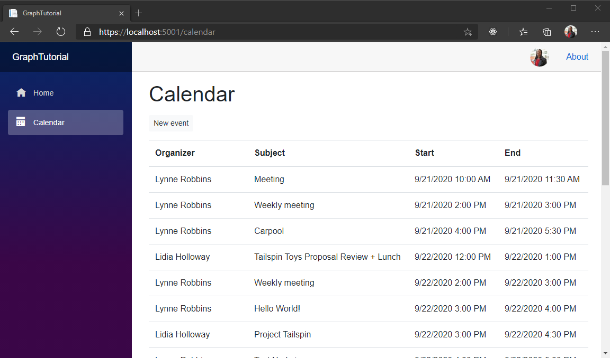

<!-- markdownlint-disable MD002 MD041 -->

<span data-ttu-id="b9131-101">En esta sección, incorporará Microsoft Graph a la aplicación para obtener una vista del calendario del usuario para la semana actual.</span><span class="sxs-lookup"><span data-stu-id="b9131-101">In this section you will further incorporate Microsoft Graph into the application to get a view of the user's calendar for the current week.</span></span>

## <a name="get-a-calendar-view"></a><span data-ttu-id="b9131-102">Obtener una vista de calendario</span><span class="sxs-lookup"><span data-stu-id="b9131-102">Get a calendar view</span></span>

1. <span data-ttu-id="b9131-103">Cree un nuevo archivo en el directorio **./páginas** denominado **Calendar. Razor** y agregue el código siguiente.</span><span class="sxs-lookup"><span data-stu-id="b9131-103">Create a new file in the **./Pages** directory named **Calendar.razor** and add the following code.</span></span>

    ```razor
    @page "/calendar"
    @using Microsoft.Graph
    @using TimeZoneConverter

    @inject GraphTutorial.Graph.GraphClientFactory clientFactory

    <AuthorizeView>
        <Authorized>
            <!-- Temporary JSON dump of events -->
            <code>@graphClient.HttpProvider.Serializer.SerializeObject(events)</code>
        </Authorized>
        <NotAuthorized>
            <RedirectToLogin />
        </NotAuthorized>
    </AuthorizeView>

    @code{
        [CascadingParameter]
        private Task<AuthenticationState> authenticationStateTask { get; set; }

        private GraphServiceClient graphClient;
        private IList<Event> events = new List<Event>();
        private string dateTimeFormat;
    }
    ```

1. <span data-ttu-id="b9131-104">Agregue el siguiente código dentro de la `@code{}` sección.</span><span class="sxs-lookup"><span data-stu-id="b9131-104">Add the following code inside the `@code{}` section.</span></span>

    :::code language="csharp" source="../demo/GraphTutorial/Pages/Calendar.razor" id="GetEventsSnippet":::

    <span data-ttu-id="b9131-105">Considere lo que hace este código.</span><span class="sxs-lookup"><span data-stu-id="b9131-105">Consider what this code does.</span></span>

    - <span data-ttu-id="b9131-106">Obtiene la zona horaria, el formato de fecha y el formato de hora del usuario actual de las notificaciones personalizadas agregadas al usuario.</span><span class="sxs-lookup"><span data-stu-id="b9131-106">It gets the current user's time zone, date format, and time format from the custom claims added to the user.</span></span>
    - <span data-ttu-id="b9131-107">Calcula el inicio y el final de la semana actual en la zona horaria preferida del usuario.</span><span class="sxs-lookup"><span data-stu-id="b9131-107">It calculates the start and end of the current week in the user's preferred time zone.</span></span>
    - <span data-ttu-id="b9131-108">Obtiene una vista de calendario de Microsoft Graph para la semana actual.</span><span class="sxs-lookup"><span data-stu-id="b9131-108">It gets a calendar view from Microsoft Graph for the current week.</span></span>
        - <span data-ttu-id="b9131-109">Incluye el `Prefer: outlook.timezone` encabezado para que Microsoft Graph devuelva las `start` propiedades y `end` en la zona horaria especificada.</span><span class="sxs-lookup"><span data-stu-id="b9131-109">It includes the `Prefer: outlook.timezone` header to cause Microsoft Graph to return the `start` and `end` properties in the specified time zone.</span></span>
        - <span data-ttu-id="b9131-110">Usa `Top(50)` para solicitar hasta 50 eventos en la respuesta.</span><span class="sxs-lookup"><span data-stu-id="b9131-110">It uses `Top(50)` to request up to 50 events in the response.</span></span>
        - <span data-ttu-id="b9131-111">Usa `Select(u => new {})` para solicitar solo las propiedades que usa la aplicación.</span><span class="sxs-lookup"><span data-stu-id="b9131-111">It uses `Select(u => new {})` to request just the properties used by the app.</span></span>
        - <span data-ttu-id="b9131-112">Usa `OrderBy("start/dateTime")` para ordenar los resultados por hora de inicio.</span><span class="sxs-lookup"><span data-stu-id="b9131-112">It uses `OrderBy("start/dateTime")` to sort the results by start time.</span></span>

1. <span data-ttu-id="b9131-113">Guarde todos los cambios y reinicie la aplicación.</span><span class="sxs-lookup"><span data-stu-id="b9131-113">Save all of your changes and restart the app.</span></span> <span data-ttu-id="b9131-114">Elija el elemento de navegación **calendario** .</span><span class="sxs-lookup"><span data-stu-id="b9131-114">Choose the **Calendar** nav item.</span></span> <span data-ttu-id="b9131-115">La aplicación muestra una representación JSON de los eventos devueltos desde Microsoft Graph.</span><span class="sxs-lookup"><span data-stu-id="b9131-115">The app displays a JSON representation of the events returned from Microsoft Graph.</span></span>

## <a name="display-the-results"></a><span data-ttu-id="b9131-116">Mostrar los resultados</span><span class="sxs-lookup"><span data-stu-id="b9131-116">Display the results</span></span>

<span data-ttu-id="b9131-117">Ahora puede reemplazar el volcado de JSON con algo más fácil de uso.</span><span class="sxs-lookup"><span data-stu-id="b9131-117">Now you can replace the JSON dump with something more user-friendly.</span></span>

1. <span data-ttu-id="b9131-118">Agregue la siguiente función dentro de la `@code{}` sección.</span><span class="sxs-lookup"><span data-stu-id="b9131-118">Add the following function inside the `@code{}` section.</span></span>

    :::code language="csharp" source="../demo/GraphTutorial/Pages/Calendar.razor" id="FormatDateSnippet":::

    <span data-ttu-id="b9131-119">Este código toma una cadena de fecha ISO 8601 y la convierte en el formato de fecha y hora preferido del usuario.</span><span class="sxs-lookup"><span data-stu-id="b9131-119">This code takes an ISO 8601 date string and converts it into the user's preferred date and time format.</span></span>

1. <span data-ttu-id="b9131-120">Reemplace el `<code>` elemento que hay en el `<Authorized>` elemento por lo siguiente.</span><span class="sxs-lookup"><span data-stu-id="b9131-120">Replace the `<code>` element inside the `<Authorized>` element with the following.</span></span>

    :::code language="razor" source="../demo/GraphTutorial/Pages/Calendar.razor" id="CalendarViewSnippet":::

    <span data-ttu-id="b9131-121">Se crea una tabla de los eventos devueltos por Microsoft Graph.</span><span class="sxs-lookup"><span data-stu-id="b9131-121">This creates a table of the events returned by Microsoft Graph.</span></span>

1. <span data-ttu-id="b9131-122">Guarde los cambios y reinicie la aplicación.</span><span class="sxs-lookup"><span data-stu-id="b9131-122">Save your changes and restart the app.</span></span> <span data-ttu-id="b9131-123">Ahora la página de **calendario** representa una tabla de eventos.</span><span class="sxs-lookup"><span data-stu-id="b9131-123">Now the **Calendar** page renders a table of events.</span></span>

    
